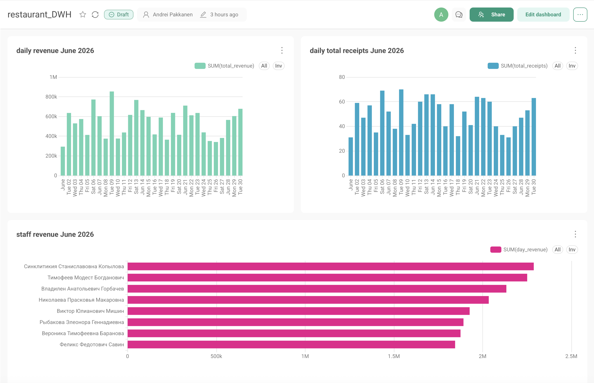

# Restaurant Analytics DWH

### О проекте
Данный проект представляет собой решение по созданию централизованного хранилища данных (DWH) для ресторанного бизнеса. Основная цель — автоматизация сбора, трансформации и визуализации данных для оперативного контроля ключевых показателей эффективности (KPI).

### Roadmap
* [x] Настройка инфраструктуры (Docker-compose).
* [x] Развернута база Postgres.
* [x] Развернута база ClickHouse.
* [x] Настроена оркестрация пайплайнов в Apache Airflow.
* [ ] In progress: Перенос SQL-трансформаций в dbt (для контроля качества данных (Data Quality) и построения Lineage).
* [ ] Planned: Расширение DWH доменом складского учета: интеграция таблиц с остатками, технологическими картами (ТТК) и расчет себестоимости (Food Cost).
* [ ] Planned: Масштабирование архитектуры для подключения внешних источников (агрегаторы доставки) и поддержки мульти-ресторанной сети.

### Технологический стек
* **Оркестрация**: Apache Airflow
* **Хранилище данных (DWH)**: ClickHouse
* **Источник данных**: PostgreSQL
* **BI & Визуализация**: Preset (Apache Superset)
* **Инфраструктура**: Docker, Docker Compose

### Архитектура решения
1. **Генерация данных**: Автоматизированная генерация транзакционных данных (чеков) в PostgreSQL.
2. **ETL-процессы**: Airflow управляет запуском скриптов генерации и пайплайнами обработки данных.
3. **Слои данных**: 
    * **Bronze Layer**: Исходные данные, забираемые из Postgres через ClickHouse Engine.
    * **Silver Layer**: Очистка, нормализация и приведение данных к единому формату.
    * **Gold Layer**: Витрины данных, готовые для бизнес-аналитики.
4. **BI-слой**: Подключение витрин к Preset для интерактивной визуализации.

### Бизнес-результат
Внедренное DWH-решение автоматизирует сбор данных и расчет ключевых показателей ресторана, исключая ручной труд и минимизируя человеческий фактор. Готовые витрины (Gold Layer) переводят мониторинг финансовых метрик и продуктивности персонала в единый интерактивный дашборд. Это предоставляет бизнесу единую и достоверную точку правды (Single Source of Truth) для ежедневного принятия управленческих решений.

### BI-слой и Отчетность
Дашборд построен в **Preset (Apache Superset)**. Данные подтягиваются напрямую из витрин слоя Gold в ClickHouse.
Данные на скриншоте показывают выручку по дням, количество чеков и выручку по каждому сотруднику за июнь 2026 г.


### Инструкция по локальному запуску (Getting Started)
**Предварительные требования:**
Для локального запуска проекта на вашем компьютере должны быть установлены:
* **Docker** и **Docker Compose**
* **Git**

**Пошаговый запуск:**
1. **Клонируйте репозиторий:**
    ```bash
    git clone https://github.com/AnttiPakkanen/restaurant_project.git
    cd restaurant_project
    ```
2. **Запустите скрипт инициализации:**
    ```bash
    ./init.sh
    ```
3. **Откройте файл .env в любом текстовом редакторе и задайте свои пароли для PostgreSQL и ClickHouse**
4. **Запустите инфраструктуру:**
    Поднимите все необходимые сервисы (базы данных и Airflow) одной командой:
    ```bash
    docker compose up -d
    ```
5. **Инициализация ETL-процесса:**
    * Перейдите в веб-интерфейс Airflow по адресу: http://localhost:8080 (по умолчанию логин/пароль: airflow / airflow).
    * В списке дагов (DAGs) найдите пайплайн receipts_daily_load.
    * Активируйте его (переведите переключатель в положение On) и запустите вручную (Trigger DAG), чтобы сгенерировать данные в Postgres и перенести их в ClickHouse.
6. **Остановка сервисов:**
    Чтобы остановить работу проекта и освободить ресурсы компьютера, используйте команду:
    ```bash
    docker compose down
    ```